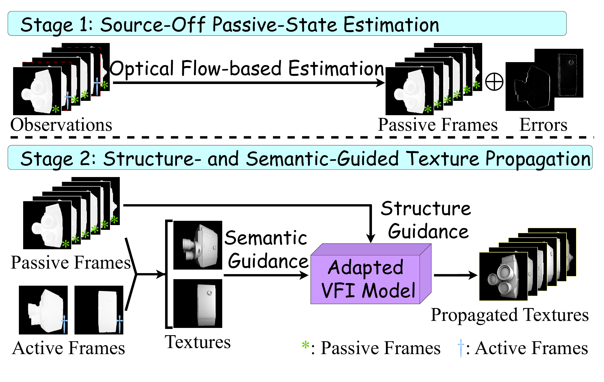
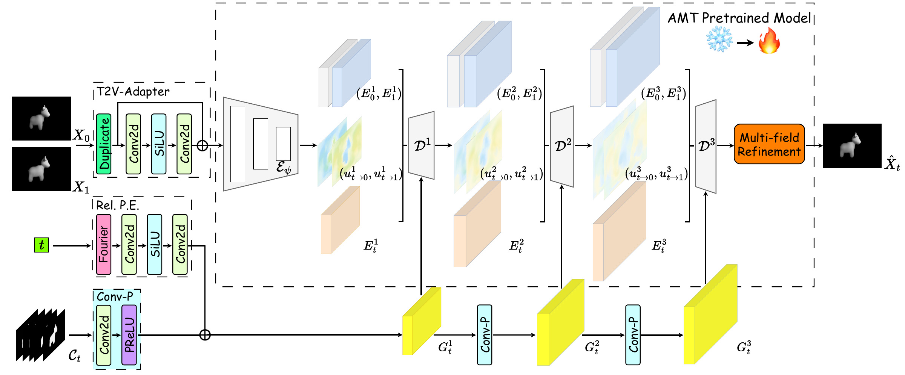

# T<sup>2</sup>exture

<p align="center">
  <strong>T<sup>2</sup>exture: Sparsely Perturbed Thermal Texture Imaging</strong>
</p>
<p align="center">
  Jiashuo Chen<sup>†</sup>, Cheng Dai<sup>†</sup>, Yanan Hu, and Fanglin Bao
</p>
<p align="center">
  <sup>†</sup>Contributed equally and listed alphabetically.
</p>
<p align="center">
  <a href="https://openreview.net/forum?id=yKDtsc6uQn&amp;noteId=yKDtsc6uQn">Paper</a>
  &nbsp;·&nbsp;
  <a href="https://huggingface.co/chenjiashuo/T2exture_model/tree/main">Models</a>
  &nbsp;·&nbsp;
  <a href="https://huggingface.co/datasets/chenjiashuo/T2exture_datasets/tree/main">Dataset</a>
</p>

Official PyTorch implementation of T<sup>2</sup>exture. The repository
supports deterministic dataset preparation, Stage 1 passive-state estimation,
Stage 2 texture reconstruction, training, and full-reference evaluation.

## Overview

<p align="center">
  
</p>
<p align="center">
  <em>Method schematic. Stage 1 estimates the passive state at active frames;
  Stage 2 propagates thermal texture using structural and semantic guidance.</em>
</p>

<p align="center">
  
</p>
<p align="center">
  <em>Stage 2 architecture. The adapted AMT backbone combines the endpoint
  textures, observation time, and passive context to reconstruct each target texture.</em>
</p>

The repository intentionally contains **no model or dataset download script**.
Obtain the released artifacts manually, then place them locally as described
below.

## Environment

Create the pinned Conda environment from the repository root:

```bash
conda env create -f environment.yaml
conda activate t2exture
```

The release was prepared for Python 3.10 and PyTorch 2.6 with CUDA 12.4. A
CUDA-capable device is recommended; the entry points fall back to CPU when
CUDA is unavailable.

## Local artifacts

Manually download the model files from
[T2exture_model](https://huggingface.co/chenjiashuo/T2exture_model/tree/main)
and the dataset files from
[T2exture_datasets](https://huggingface.co/datasets/chenjiashuo/T2exture_datasets/tree/main).
Do not rename individual files. Extract or copy the two directories into the
following layout:

```text
T2exture/
├── pretrained/
│   └── t2exture_model/
│       ├── t2exture-s.pt      # full Stage 2 checkpoint (optional)
│       ├── t2exture-l.pt      # full Stage 2 checkpoint (optional)
│       ├── t2exture-g.pt      # full Stage 2 checkpoint (optional)
│       ├── amt-s.pth          # Stage 1 / training initializer (optional)
│       ├── amt-l.pth          # Stage 1 / training initializer (optional)
│       └── amt-g.pth          # Stage 1 / training initializer (optional)
└── datasets/
    └── T2exture_datasets/
        ├── train.txt
        ├── valid.txt
        ├── test.txt
        ├── sim/
        └── flow/
            └── s10/
```

Choose one matched variant (`s`, `l`, or `g`). Direct reconstruction uses
its full `t2exture-<variant>.pt` checkpoint. Stage 1 estimation and training
use the corresponding `amt-<variant>.pth` initializer. The dataset includes
the fixed splits and pseudo-flow labels required by training.

## Inference

Stage 1 estimates the source-off passive state at active frames. Run it once
for a dataset and variant, then reuse the resulting cache for Stage 2
reconstruction.

### Synthetic benchmark

```bash
python stage1.py \
  --mode synthetic \
  --data-root datasets/T2exture_datasets \
  --backbone amt-l \
  --pretrained pretrained/t2exture_model/amt-l.pth \
  --output-dir outputs/source_off/amt-l

python infer.py \
  --mode synthetic \
  --variant l \
  --checkpoint pretrained/t2exture_model/t2exture-l.pt \
  --data-root datasets/T2exture_datasets \
  --source-off-root outputs/source_off/amt-l \
  --split test \
  --output-dir outputs/infer_synthetic_l
```

Predictions are written to `outputs/infer_synthetic_l/pred/`; the accompanying
`predictions.csv` and `manifest.json` record each reconstructed target frame.

### Real LWIR sequences

Use the same directory for the `source_on/` and `passive/` observations of
each sequence. The sequence names and active-frame schedule are specified in
`configs/real.yaml`.

```bash
python stage1.py \
  --mode real \
  --data-root /path/to/real_lwir \
  --backbone amt-l \
  --pretrained pretrained/t2exture_model/amt-l.pth \
  --output-dir outputs/real_source_off/amt-l

python infer.py \
  --mode real \
  --variant l \
  --checkpoint pretrained/t2exture_model/t2exture-l.pt \
  --data-root /path/to/real_lwir \
  --source-off-root outputs/real_source_off/amt-l \
  --output-dir outputs/infer_real_l
```

For a subset of configured sequences, append `--sequences <sequence_name>` to
both commands. A real sequence can also provide `texture/` frames directly;
otherwise the active-frame texture anchor is formed as `[S_on - S_off]_+`.

## Training

Prepare the Stage 1 cache for the selected variant as shown above, then launch
the two-phase Stage 2 adaptation and finetuning workflow:

```bash
python train.py \
  --variants l \
  --data-root datasets/T2exture_datasets \
  --source-off-root outputs/source_off \
  --output-root outputs/train \
  --log-root outputs/logs
```

`train.py` selects the matching AMT initializer from
`pretrained/t2exture_model/`, saves `best.pt` and `last.pt`, and evaluates
the best checkpoint on the synthetic test split. Default optimization, loss,
and data settings are defined in `train.yaml`.

To evaluate a checkpoint independently:

```bash
python eval.py \
  --data-root datasets/T2exture_datasets \
  --checkpoint outputs/train/t2exture-l/best.pt \
  --backbone amt-l \
  --source-off-root outputs/source_off/amt-l \
  --split test \
  --output-dir outputs/eval_l
```

Before a long run, verify the dataset layout, pseudo-flow coverage, and
source-off cache:

```bash
python preflight.py \
  --data-root datasets/T2exture_datasets \
  --require-source-off
```

## Dataset preparation

The released dataset is ready for training and does not need preprocessing.
`prepare_datasets.py` is provided only for preparing a compatible raw dataset
that already contains `flow/s10` pseudo-flow labels. It applies one
deterministic scene-level crop to the texture, passive, source-on, and flow
arrays:

```bash
python prepare_datasets.py \
  --source-root /path/to/raw_dataset \
  --output-root datasets/prepared_dataset
```

## Repository structure

```text
config.py                 Shared protocol and configuration helpers
data.py                   Synthetic benchmark dataset and dataloader
stage1.py                 Passive-state estimation at active frames
stage2.py                 Two-phase Stage 2 training
train.py                  Training and test-evaluation wrapper
infer.py                  Synthetic and real reconstruction
eval.py                   Full-reference benchmark evaluation
prepare_datasets.py       Deterministic dataset preparation
preflight.py              Dataset and cache validation
model/                    T2exture model definitions
losses/                   Training objectives
metrics/                  Benchmark metrics
flow_generation/          Pseudo-flow label indexing and loading
utils/                    Checkpoint and flow helpers
```

## Citation

If you use this code, please cite the accompanying T2exture paper.
